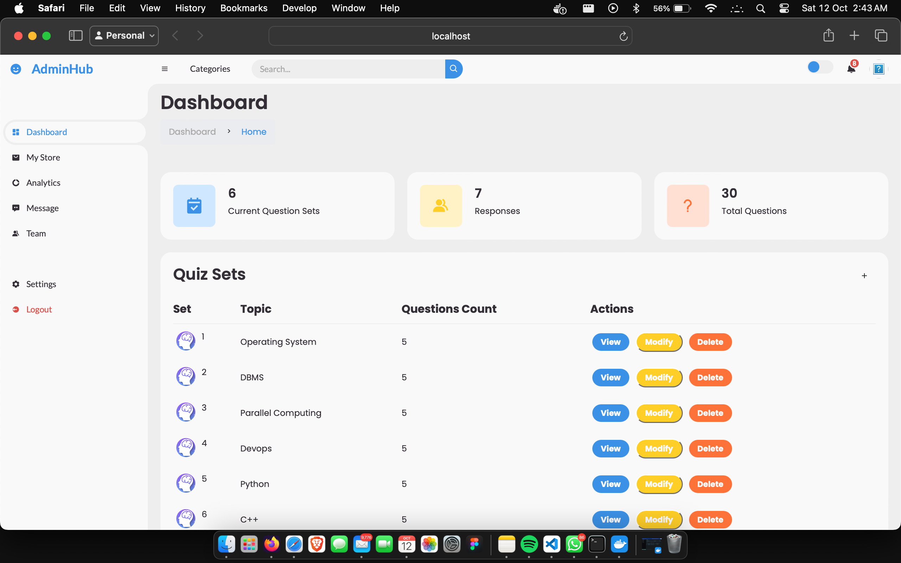
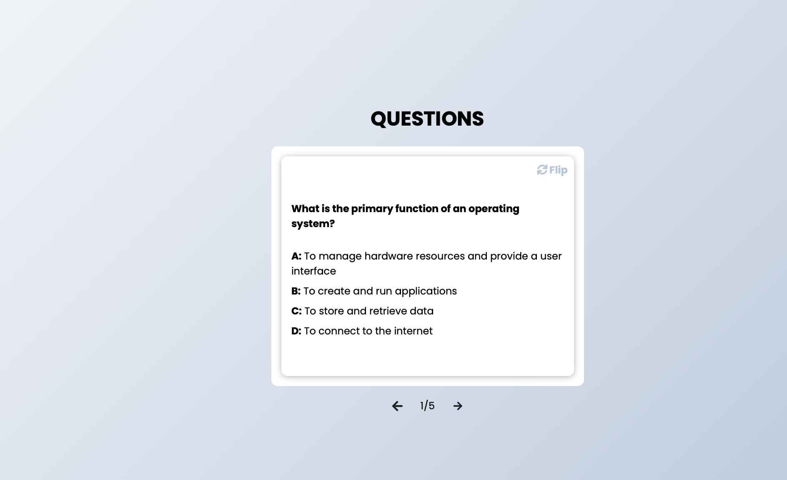
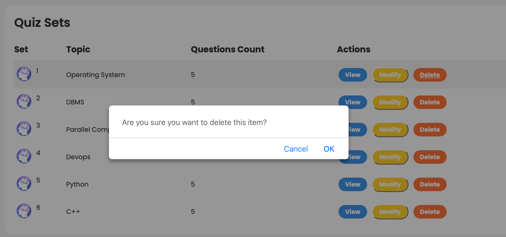
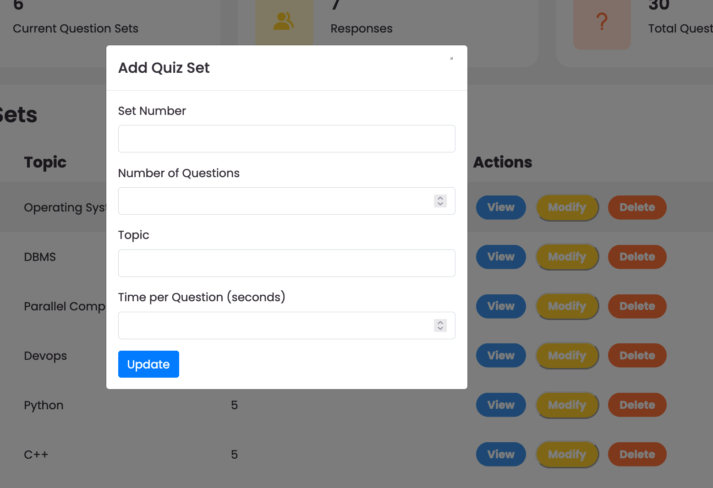
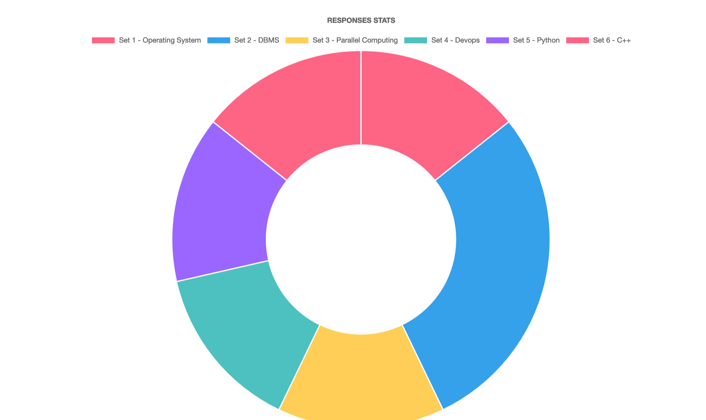
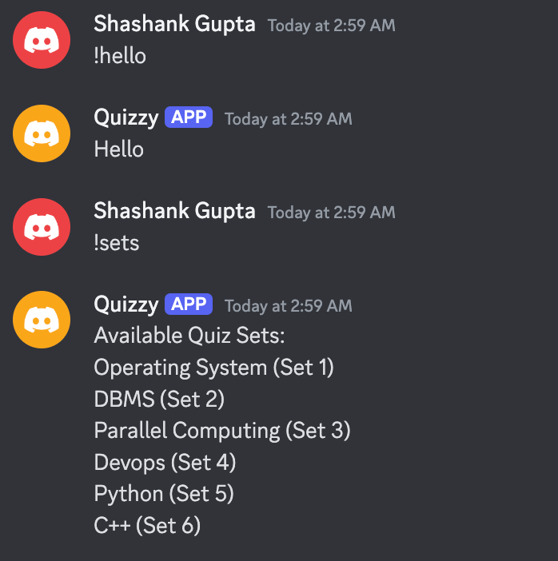
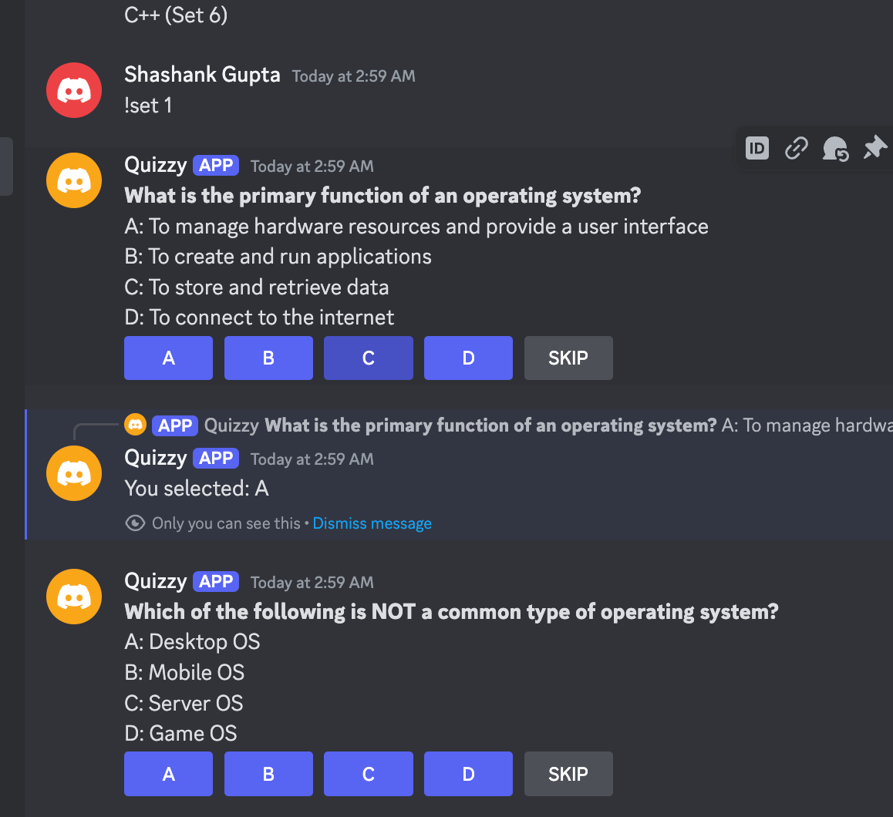
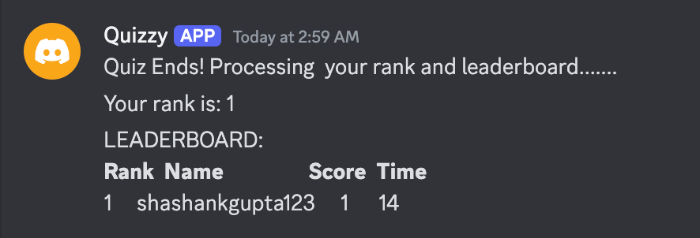

# Quizzy    

## Table of Contents

- [About The Project](#about-the-project)
  - [Built With](#built-with)
- [Getting Started](#getting-started)
  - [Prerequisites](#prerequisites)
  - [Installation](#installation)
  - [Running with Docker](#running-with-docker)
  
## About The Project

This project consists of two main components: a **Discord Quiz Bot** and a **Quiz Management Application**. The goal is to create an interactive quiz experience for users on Discord while providing a web-based interface for admins to manage quizzes and questions.

### Discord Quiz Bot   [Bot demo](https://drive.google.com/file/d/1GUkRYxtZMVVFOnZTVKVyWq_4ZhoE7koT/view?usp=sharing)

The **Discord Quiz Bot** enables users to participate in quizzes directly within Discord servers. Key features include:

- **Quiz Selection**: The bot displays a list of all available quizzes  sets for users to choose from. Each quiz consists of multiple-choice questions.
- **Timed Questions**: Once a quiz is selected, the bot presents each question one by one, with a set timer (e.g., 30 seconds per question). The bot tracks how much time users take to answer each question.
- **Leaderboard**: After the quiz, the bot displays a leaderboard ranking players based on their performance. The leaderboard is sorted by:
  - **Points**: Users earn points based on the number of correct answers.
  - **Time**: If multiple users have the same number of correct answers, their ranking is decided by the time taken to answer the questions (faster users rank higher).
  - The leaderboard shows the top 10 players, as well as each user's rank, even if they are not in the top 10.

## Commands

Here are some commands you can use:

- **!hello**: Say hello to the bot!
- **!goodbye**: Say goodbye!
- **!sets**: Show the current available quiz sets.
- **!set "set_number"**: Choose the set you want to attend. For example: `!set 1`
- **!leaderboard "set_number"**: Check the leaderboard for a specific set. For example: `!leaderboard 1`

### Quiz Management Application

The **Quiz Management Application** is a web-based CRUD (Create, Read, Update, Delete) interface for managing quiz sets and individual questions. Features include:

- **Quiz Set Management**: Admins can create, update, and delete quiz sets (e.g., each set contains 10 questions).
- **Real-Time Sync**: The quiz management app is connected to the same database used by the Discord Quiz Bot, ensuring that any changes made in the admin panel are instantly reflected in the quizzes displayed to users during gameplay.

### AI-Generated Quiz Questions

To enhance quiz content creation, this project integrates **Large Language Models (LLMs)**, specifically the **Gemini API** via the Gemini SDK. Admins or question setters can specify the **topic** and the **number of questions** required for a quiz. The process works as follows:

1. **User Input**: Admins fill out a form, specifying the topic (e.g., "Science"), and the number of questions (e.g., "10 questions").
2. **API Request**: The application sends these parameters (topic and question count) to the **Gemini API** through the SDK.
3. **API Response**: The Gemini API generates a set of quiz questions based on the provided parameters and returns the questions in **JSON-formatted text** (not a JSON file). The response is structured as text, making it easier to parse and store directly in the database.
4. **Storage**: The generated quiz questions are parsed, formatted, and stored in the database in real-time, ensuring they are available for use in the Discord Quiz Bot and for display in the quiz management panel.

This integration significantly streamlines quiz creation, ensuring a diverse variety of quiz questions that can be generated dynamically without manual input from admins. The Gemini API’s flexibility allows for easy adjustments based on topic and question count, making quiz creation both efficient and customizable.

## Websockets

### Why Websockets?

In web development, **WebSockets** are crucial for enabling **real-time, two-way communication** between the client and the server over a single, persistent connection. Unlike traditional HTTP, where each request/response cycle is separate and stateless, WebSockets maintain an open connection that allows data to flow continuously in both directions. This makes it ideal for applications that require live updates, such as **real-time chat**, **live notifications**, or, in this case, **interactive quizzes**.

### Importance of Websockets in This Project

When building a real-time quiz system like this one, the use of **WebSockets** is especially important for several reasons:

1. **Efficiency**: If we were to use the traditional **HTTP request-response cycle** for each question in the quiz, we would need to initiate a new request every time a user answers a question. This would create unnecessary overhead for both the client and server, resulting in **increased latency** and **higher server load**. Every question would trigger a separate HTTP request, which can quickly become inefficient.

2. **Reduced Server Overhead**: Instead of following the traditional HTTP request/response cycle, we can load all questions at once and maintain a **live connection** with the client. This reduces the need for repeated HTTP requests and responses. The server only needs to send updates as necessary, without reprocessing each question individually.

3. **Security Best Practices**: While one alternative would be to load the entire quiz (all questions) in a single HTTP request, this is **not preferred** for several reasons:
   - **Client-side Processing**: Bringing all questions in one request might seem efficient, but it can expose too much data at once. Processing quiz questions client-side opens the door to **security vulnerabilities**, as the user has access to the full set of questions (and potentially the answers) before the quiz even starts.
   - **Sensitive Data Exposure**: Even if the quiz content itself isn't classified as sensitive data, exposing too much at once can lead to unintended security risks. For example, users could manipulate data or game the system if they had access to all questions in advance.

### Leveraging WebSockets with Django Channels

In this project, we've used **Django Channels** to implement WebSockets for real-time communication between the server and the client. Here's how it works:

- **Live Connection**: When a user starts a quiz (e.g., **Quiz 1**), a WebSocket connection is established between the user's client and the server. This connection stays open for the entire duration of the quiz.
  
- **Efficient Data Delivery**: The server can then send **questions one at a time** (or in a batch) as the quiz progresses, without needing to close and reopen connections for each question. This means that the server doesn't need to handle multiple HTTP requests, reducing overhead and improving performance.

- **Real-Time Updates**: WebSockets allow the server to push **real-time updates** to the client, such as showing the next question, updating the timer, and even sending quiz results dynamically. This keeps the user experience smooth and interactive.

In summary, **WebSockets** are used to **maintain a persistent connection**, allowing the server to send quiz questions as needed and minimizing unnecessary requests, while also improving security by keeping sensitive data like quiz questions under server control.

By using **Django Channels**, we were able to easily implement WebSockets and handle real-time data transmission, ensuring a **smooth, interactive experience** for users participating in the quiz.


## Built With

This project was built using the following technologies and tools:

- **[Django](https://www.djangoproject.com/)** - The web framework used for building the Quiz Management Application and handling backend logic.
- **[Python](https://www.python.org/)** - The primary programming language for backend development.
- **[discord.py](https://discordpy.readthedocs.io/en/stable/)** - A Python library used for creating the **Discord Quiz Bot**, allowing interaction with the Discord API for quiz handling and communication with users.
- **[HTML](https://developer.mozilla.org/en-US/docs/Web/HTML)** - Used for creating the structure of the web pages in the Quiz Management Application.
- **[CSS](https://developer.mozilla.org/en-US/docs/Web/CSS)** - Used for styling the web pages and ensuring a responsive design.
- **[JavaScript](https://developer.mozilla.org/en-US/docs/Web/JavaScript)** - Used for interactivity on the client-side, including handling the dynamic elements in the web interface.
- **[Chart.js](https://www.chartjs.org/)** - A library used for displaying **interactive charts** on the leaderboard, showing player rankings and performance.
- **[Django Channels](https://channels.readthedocs.io/en/stable/)** - Used to implement **WebSockets** for real-time communication between the server and the client during quizzes.
- **[Gemini API](https://www.google.com/search?q=gemini+api)** - Utilized to generate dynamic quiz questions via AI, integrating with the **Gemini SDK** for question generation based on topic and question count.
- **[Docker](https://www.docker.com/)** - Used for containerizing the entire application, ensuring consistent deployment across different environments.
- **[ASGI](https://asgi.readthedocs.io/en/latest/)** - The asynchronous server gateway interface used to support WebSockets and asynchronous processing in Django.
- **[Daphne](https://www.django-channels.com/)** - The ASGI server used to handle HTTP and WebSocket requests, enabling real-time communication for the quiz system.

## Getting Started

### Prerequisites

Before you begin, ensure that your system meets the following prerequisites:

- **[Django](https://www.djangoproject.com/)** (>=4.0, <5.0) - A high-level Python web framework.
- **[Django Channels](https://channels.readthedocs.io/en/stable/)** (>=4.0) - For adding WebSocket support to Django.
- **[Daphne](https://www.django-channels.com/)** (>=4.0, <5.0) - ASGI server used to handle HTTP and WebSocket requests.
- **[python-decouple](https://github.com/hynek/decouple)** (>=3.5, <4.0) - For managing environment variables.
- **[discord.py](https://discordpy.readthedocs.io/en/stable/)** (>=2.0, <3.0) - A Python library for interacting with the Discord API to build the quiz bot.
- **[websockets](https://websockets.readthedocs.io/en/stable/)** (>=10.0, <11.0) - WebSocket client library for real-time communication.
- **[google-generativeai](https://pypi.org/project/google-generativeai/)** - API for integrating **Gemini** AI for dynamic quiz question generation.
- **[requests](https://requests.readthedocs.io/en/master/)** (>=2.25, <3.0) - For making HTTP requests.
- **[django-cors-headers](https://pypi.org/project/django-cors-headers/)** (>=3.10, <4.0) - Handles Cross-Origin Resource Sharing (CORS).
- **[django-background-tasks](https://github.com/arteria/django-background-tasks)** (>=1.1, <2.0) - Optional for managing background tasks.
- **[python-dotenv](https://pypi.org/project/python-dotenv/)** - To load environment variables from `.env` files.

To install all required dependencies, you can run:

```bash
pip install -r requirements.txt
```
# Installation

Follow these steps to set up and run the project locally:

## 1. Clone the Repository

Clone the repository from GitHub to your local machine:

```bash
git clone https://github.com/shanky2003g/Discord_QuizBot.git
```
## 2. Create Your Gemini API Key

You will need a Gemini API key to interact with the Gemini API.

1. Go to the [Gemini API Key Management page](https://gemini.com/api).

## 3. Create Your Discord Bot and Get the Bot Token

You’ll need to create a Discord bot and get your bot token to authenticate and interact with the Discord API.

1. Go to the [Discord Developer Portal](https://discord.com/developers/applications).
2. Log in with your Discord account.
3. Click on **New Application**.
4. Name your application and click **Create**.
5. Navigate to the **Bot** tab on the left, then click **Add Bot**.
6. Under the **Bot settings**, click **Copy** under **TOKEN** to get your bot token. 
7. Store it securely, as you’ll need it to connect your bot.

---

## 4. Invite Your Bot to a Discord Server

To invite your bot to a server, you will need to create an OAuth2 URL.

1. In the Discord Developer Portal, go to your application page.
2. Navigate to the **OAuth2** tab on the left.
3. Under **OAuth2 URL Generator**, check the **bot** scope.
4. Under **OAuth2 URL Generator**, under **Bot Permissions**, select the permissions your bot needs (e.g., "Send Messages", "Manage Messages", etc.).
5. Copy the generated URL, then paste it into your browser.
6. Select the server you want to invite the bot to and click **Authorize**.

## 5. Get Your Authentication Tokens

After setting up the Gemini API key and Discord bot, you will need to authenticate your application using the tokens.

### Set the Authentication Tokens as Environment Variables

To securely store your API keys and bot token, you can set them as environment variables on your machine. Open your terminal and run the following commands:

```bash
export GEMINI_API_KEY='your-api-key'
export GEMINI_API_SECRET='your-api-secret'
export DISCORD_BOT_TOKEN='your-discord-bot-token'
```

---

## 6. Running the Server and Discord Bot

### 1. Run the Django Server

To start the Django development server, use the following command:

```bash
python manage.py runserver
```
This will start the server locally at http://127.0.0.1:8000.
### 2. Run the Discord Bot
```bash
python bot.py
```
This will start the Discord bot and connect it to your server. The bot will now be live and able to interact with users on Discord.

---

## Running with Docker

To run the project using Docker, follow these steps:

### 1. Build the Docker Image

First, you need to build the Docker image for the project. From the root of your project directory, run the following command:

```bash
docker build -t project-name .
```
This will build the Docker image and tag it as project-name.
### 2. Run the Docker Container

Once the image is built, you can run the Docker container using the following command:
```bash
docker run -d -p 8000:8000 --name project-container project-name
```
This will start the Django development server inside the container and expose it on port 8000 of your local machine.


## Relevant Screenshots:
### 1. Admin Panel: Admin can view, update, delete the exiting sets.


- **View**:


- **Delete**:


- **Modify and Add**:


- **Response statistics**:


### 2. Bot:




